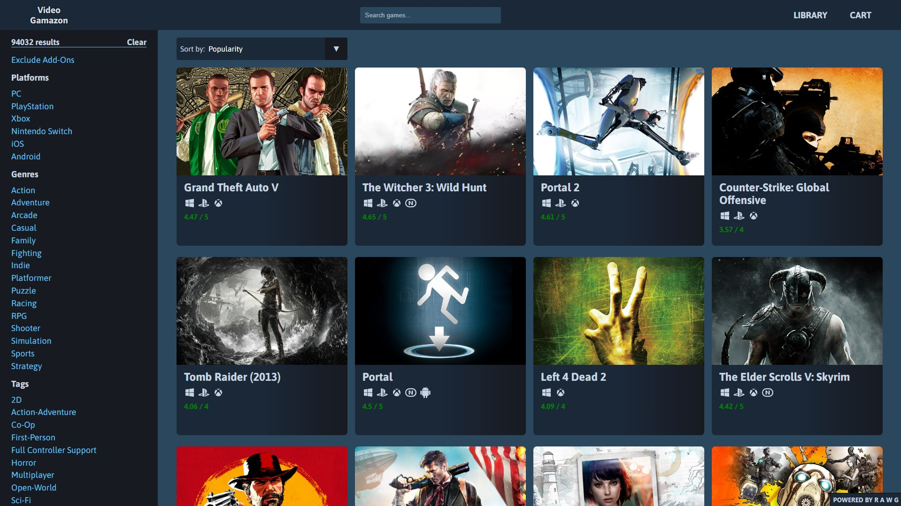
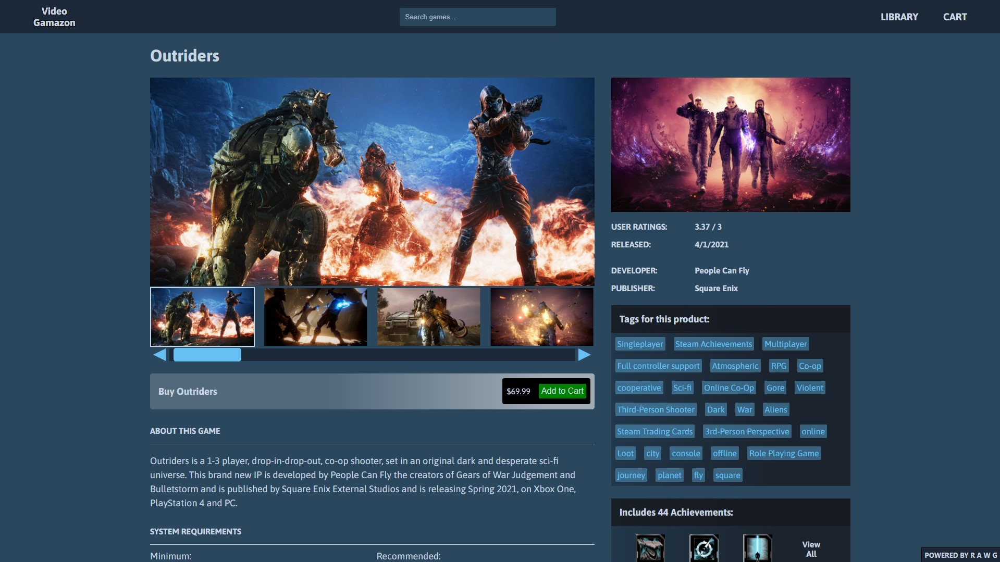
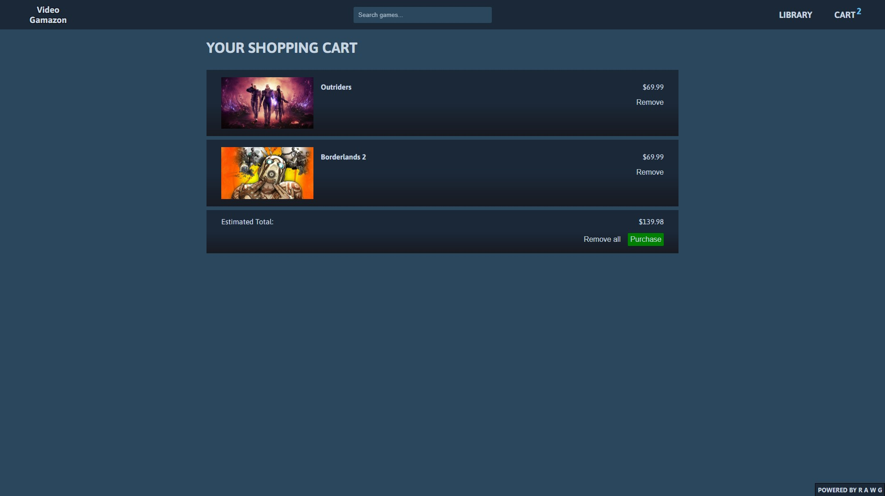
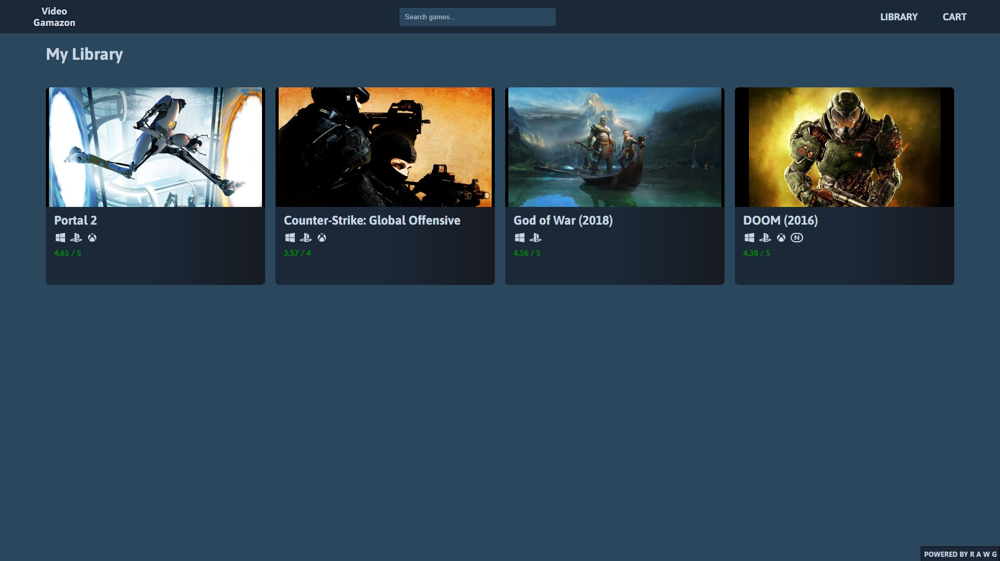

<h1 align='center'>Video Gamazon</h1>

Shopping Cart for <a href='https://www.theodinproject.com/paths/full-stack-javascript/courses/react'>The Odin Project</a>

<h2>Demo</h2>

[Live Demo](https://videogamazon.netlify.app)

<h2>Built with</h2>

<h3>Front-End</h3>

- HTML React Parser
- RAWG API
- React
- React Router
- Styled-Components

<h3>Back-End</h3>

- Netlfiy
- Node.js

 

<h2>Features</h2>

- Search through a large catalog of games thanks to the [RAWG API](https://rawg.io/apidocs).
- View game information such as it's developers, publishers, requirements, or even achievements.
- Filter results by platform, genre, or tags.
- Sort results by Metacritic score, name, popularity, release date, or user rating.
- Place games in your Shopping Cart to 'purchase' (Note: No games are actually sold on this website.)
- View 'purchased' games in the library.

 

<h2>Screenshots</h2>

 

<h2>What I Learned</h2>

The purpose of this project was to test my knowledge of React Router by building a mock website to simulate an online shopping cart. I chose RAWG API to acquire product information in the form of video games. In order to keep track of the games in the user's cart and library, I learned how to implement useContext, which allowed me pass the data of games that the user was interested in down the component tree, meaning I could keep track of the games the user wanted and serve the appropriate visuals for them in their cart and library. To retrieve data, I learned how to make use of Netlify functions, which also helped me to hide the API key from the client. Data is retrieved from the netlify functions through the usage of React Query, which I learned could be extremely useful retrieving and caching data, and I was able to adjust it to prevent the re-calls which removes unnecessary strain on the API usage. Future plans for this project include responsive styling and minor CSS tweaks, as well as the exploration of React Redux in place of useContext (if necessary).